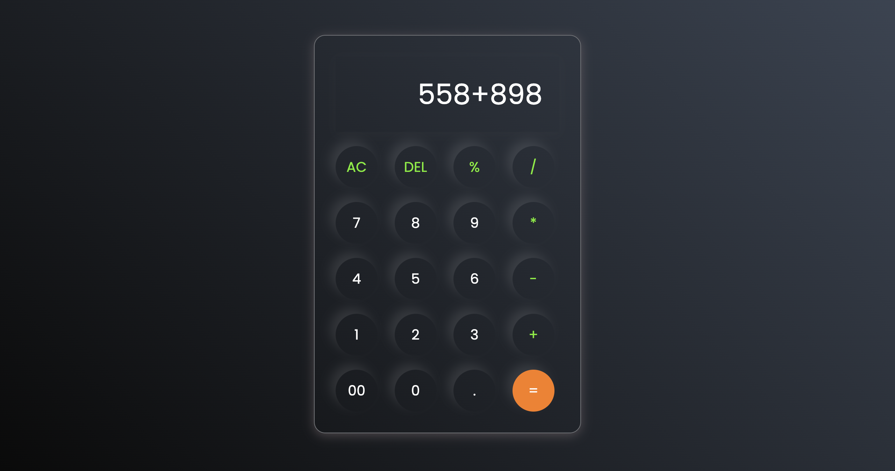

# Calculator App

The **Calculator App** is a simple and interactive web-based calculator built using HTML, CSS, and JavaScript. It allows users to perform basic arithmetic operations such as addition, subtraction, multiplication, and division. The app also includes features like clearing the input, deleting the last entered character, and evaluating expressions.

## Live Demo

You can try the live demo of the Calculator App [here](https://calculator-02-eta.vercel.app/).

## Screenshots

### Calculator Interface

## Features

- Perform basic arithmetic operations: `+`, `-`, `*`, `/`, `%`.
- Clear all input using the **AC** button.
- Delete the last entered character using the **DEL** button.
- Evaluate mathematical expressions using the **=** button.
- Responsive and visually appealing design with a modern UI.
- Error handling for invalid expressions.

## Technologies Used

- **HTML**: For structuring the calculator layout.
- **CSS**: For styling the calculator and creating a modern, responsive design.
- **JavaScript**: For implementing the calculator's functionality and interactivity.

## How to Use

1. Open the app in your browser.
2. Use the buttons to input numbers and operators.
3. Click the **=** button to evaluate the expression.
4. Use the **AC** button to clear all input.
5. Use the **DEL** button to delete the last entered character.

## Project Structure
Calculator/ ├── index.html # Main HTML file ├── style.css # Stylesheet for the calculator ├── script.js # JavaScript file for calculator logic └── assets/ # Folder for images and other assets (if any)

## How to Run the Project

1. Clone the repository or download the project files.
2. Open the `index.html` file in your browser.
3. Start using the calculator!

## Future Improvements

- Add support for advanced mathematical operations (e.g., square root, exponentiation).
- Implement a history feature to track previous calculations.
- Add keyboard support for input.
- Improve responsiveness for smaller screen sizes.

## About the Author

This project was created by **Aryan Raj**, a passionate web developer with a keen interest in building interactive and user-friendly web applications. Aryan enjoys exploring new technologies, solving problems, and creating projects that help others learn and grow in the field of web development.

You can connect with Aryan on:

- [GitHub](https://github.com/geeksaryan)  
- [LinkedIn](linkedin.com/in/aryan-kumar-220791278)  
- [Twitter](https://x.com/aryanraj7981)

Feel free to reach out for collaboration or to share feedback on this project!

## License

This project is open-source and available under the [MIT License](https://opensource.org/licenses/MIT).

---
Enjoy using the Calculator App!
